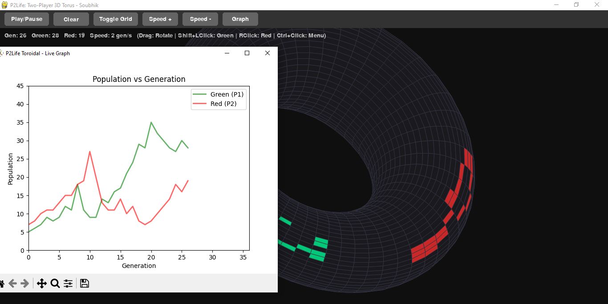

# Game of Life

Multiple implementations of Conway's Game of Life and its variations with interactive visualization and variants.

## Overview

- Standard Game of Life (GoL) - Classic infinite grid variant
- Toroidal Game of Life - Wraparound edges, finite bounded grid
- Two-Player Game of Life (p2life) - Competitive variant with two players
- Two-Player Toroidal - Competitive with bounded toroidal grid

## Installation

Requirements:

- Python 3.7+
- pygame
- matplotlib

To install dependencies:

    pip install pygame matplotlib

## Running

For standard Game of Life:

    cd gol
    python main.py

For other variants:

    cd gol_toroidal
    python main.py

    cd p2life
    python main.py

    cd p2life_toroidal
    python main.py

## Controls

- Space - Play/Pause
- C - Clear grid
- G - Toggle grid visibility
- Plus/Minus - Adjust speed
- Mouse Wheel - Zoom in/out
- Left Click - Toggle cell
- Ctrl + Right Click - Place pattern from menu

## Standard Game of Life

- Universe class stores live cells in a set
- Each generation counts neighbors and applies Conway's rules
- Live cell with 2-3 neighbors survives
- Dead cell with exactly 3 neighbors becomes alive
- All others die
- Infinite grid, only live cells are tracked

## Toroidal Variant

- Same rules as standard GoL
- Finite grid (default 50x50)
- Cell coordinates wrap around at edges using modulo arithmetic
- No cells are lost at boundaries

## Two-Player Game of Life

Cells are owned by a player (WHITE or BLACK).

Survival rules:

- Live cell survives if net neighbor advantage is 2-3
- Live cell survives with advantage 1 if it has 2+ friendly neighbors

Birth rules:

- Empty cell with 3 neighbors of one color becomes that color
- Empty cell with 3 neighbors of both colors: random winner

## Two-Player Toroidal

- Two-player rules with toroidal wraparound
- Finite grid with player colors

## Renderer

- Pygame-based visualization
- Pan and zoom controls
- Menu bar for simulation controls
- Context menu for pattern selection (Ctrl + Right Click)
- Real-time stats (generation, population, speed)
- Optional grid overlay
- Resizable window

## Patterns

Built-in patterns organized by category.

Still Lives: Block, Beehive, Loaf, Boat, Tub

Oscillators: Blinker, Toad, Beacon, Pulsar

Spaceships: Glider, Lightweight Spaceship

Methuselahs: R-pentomino, Diehard, Acorn

Guns: Gosper Glider Gun

Breeders: Block-laying Switch Engine

## Live Graph

- Population tracking runs in a separate process
- Matplotlib plots population vs generation
- Real-time updates without UI lag

## Project Structure

gol/ - Standard Game of Life implementation

gol_toroidal/ - Toroidal variant

p2life/ - Two-player competitive variant

p2life_toroidal/ - Two-player toroidal variant

Each directory contains: engine.py, renderer.py, patterns.py, graph.py, main.py

## Features

- Interactive grid manipulation
- Multiple pre-loaded patterns
- Adjustable simulation speed (1-50 gen/sec)
- Zoom and pan the grid
- Pause/resume simulation
- Real-time population and generation tracking
- Live graphing of population over time
- Multiple topology options
- Competitive two-player variant

## References

- Wikipedia: Conway's Game of Life
- Life Lexicon: http://www.radicaleye.com/lifepage/